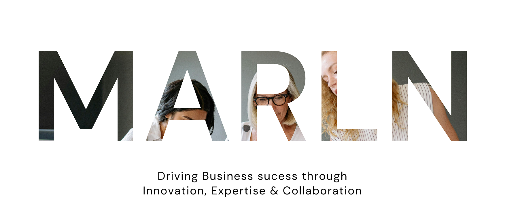
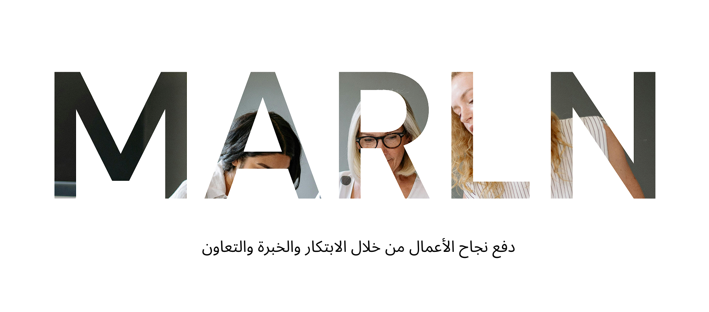
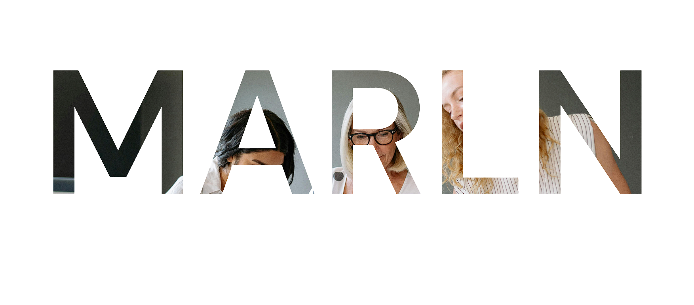

# Arabic Hero Images Implementation

## Overview

This implementation adds support for displaying different hero images based on both language (English/Arabic) and theme (Light/Dark mode) on the index.html page.

## Features

- **4 Hero Images**: English light, English dark, Arabic light, Arabic dark
- **Automatic Switching**: Images change automatically when language or theme is switched
- **Responsive Design**: All images maintain proper aspect ratio and positioning
- **Fallback Support**: Graceful handling if Arabic images are missing

## File Structure

```
images/
├── marln-hero-image.png              # English Light Mode (existing)
├── marln-hero-image-dark.png         # English Dark Mode (existing)
├── marln-hero-image-arabic.png       # Arabic Light Mode (new)
└── marln-hero-image-arabic-dark.png  # Arabic Dark Mode (new)
```

## Implementation Details

### 1. HTML Structure

The hero section in `index.html` now includes all 4 images:

```html
<section class="services-hero-section-v_2 parallax" style="position: relative; min-height: 100vh; background: white;">
    <!-- English Hero Images -->
    
    
    
    <!-- Arabic Hero Images -->
    
    
</section>
```

### 2. CSS Logic

The CSS in `index.html` handles image visibility based on language and theme:

```css
/* Arabic Hero Images - Hidden by default (English mode) */
.hero-arabic-light, .hero-arabic-dark { 
    display: none !important; 
    visibility: hidden !important; 
    opacity: 0 !important; 
}

/* Show Arabic images when language is Arabic */
html[lang="ar"] .hero-light,
html[lang="ar"] .hero-dark {
    display: none !important; 
    visibility: hidden !important; 
    opacity: 0 !important; 
}

html[lang="ar"] .hero-arabic-light {
    display: block !important; 
    visibility: visible !important; 
    opacity: 1 !important; 
}

/* Arabic Dark Mode */
html[lang="ar"][data-theme="dark"] .hero-arabic-light {
    display: none !important; 
    visibility: hidden !important; 
    opacity: 0 !important; 
}

html[lang="ar"][data-theme="dark"] .hero-arabic-dark {
    display: block !important; 
    visibility: visible !important; 
    opacity: 1 !important; 
}
```

### 3. JavaScript Integration

The language switching system in `js/lang-unified.js` includes:

- `switchHeroImagesToArabic()`: Shows Arabic images when language is switched to Arabic
- `switchHeroImagesToEnglish()`: Shows English images when language is switched to English
- `handleThemeChange()`: Ensures correct images are shown when theme changes
- Theme change observer: Listens for theme changes and updates images accordingly

## Setup Instructions

### Step 1: Create Arabic Hero Images

1. Open `create-arabic-hero-images.html` in your browser
2. Click "Generate Arabic Hero Images" to create placeholder images
3. Download both images:
   - `marln-hero-image-arabic.png` (Light mode)
   - `marln-hero-image-arabic-dark.png` (Dark mode)
4. Place both images in your `images/` folder

### Step 2: Replace Placeholder Images

Replace the generated placeholder images with your actual Arabic hero images:
- Use the same dimensions as your English hero images (recommended: 1920x1080 or similar)
- Ensure good contrast and readability for both light and dark themes
- Consider Arabic text direction and cultural elements

### Step 3: Test the Implementation

1. Open `test-arabic-hero.html` in your browser
2. Test all combinations:
   - English + Light theme
   - English + Dark theme
   - Arabic + Light theme
   - Arabic + Dark theme
3. Verify that images switch correctly

### Step 4: Test on Main Site

1. Open `index.html` in your browser
2. Test language switching using the language toggle
3. Test theme switching using the theme toggle
4. Verify that hero images change appropriately

## Image Requirements

### Technical Specifications
- **Format**: PNG (recommended) or JPG
- **Dimensions**: 1920x1080 or similar aspect ratio
- **File Size**: Optimize for web (under 1MB each)
- **Naming**: Must match exactly:
  - `marln-hero-image-arabic.png`
  - `marln-hero-image-arabic-dark.png`

### Design Considerations
- **Light Mode**: Use light backgrounds with dark text/elements
- **Dark Mode**: Use dark backgrounds with light text/elements
- **Arabic Content**: Consider right-to-left text direction
- **Brand Consistency**: Maintain Marln Corporation branding
- **Accessibility**: Ensure sufficient contrast ratios

## Troubleshooting

### Images Not Showing
1. Check file names match exactly
2. Verify images are in the `images/` folder
3. Check browser console for 404 errors
4. Ensure images are properly formatted

### Images Not Switching
1. Check that `js/lang-unified.js` is loaded
2. Verify language toggle is working
3. Check theme toggle functionality
4. Inspect CSS classes on hero images

### Performance Issues
1. Optimize image file sizes
2. Consider using WebP format for better compression
3. Implement lazy loading if needed
4. Use appropriate image dimensions

## Browser Compatibility

- **Chrome**: Full support
- **Firefox**: Full support
- **Safari**: Full support
- **Edge**: Full support
- **Mobile browsers**: Responsive design supported

## Future Enhancements

1. **WebP Support**: Add WebP versions for better performance
2. **Lazy Loading**: Implement lazy loading for hero images
3. **Animation**: Add smooth transitions between images
4. **More Languages**: Extend to support additional languages
5. **Dynamic Loading**: Load images based on user preferences

## Support

If you encounter issues:
1. Check the browser console for errors
2. Verify all files are in the correct locations
3. Test with the provided test page
4. Ensure all dependencies are loaded

## Files Modified

- `index.html`: Added Arabic hero images and CSS rules
- `js/lang-unified.js`: Added image switching functions
- `create-arabic-hero-images.html`: Image generator (new)
- `test-arabic-hero.html`: Test page (new)
- `ARABIC_HERO_IMAGES_IMPLEMENTATION.md`: Documentation (new)
